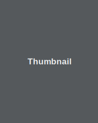

<!DOCTYPE html>
<html lang="en">
    <head>
        <title>Aj's Blog</title>
        <!-- Standard includes -->
        <meta charset="UTF-8">
        <meta http-equiv="X-UA-Compatible" content="IE=edge">
        <meta name="viewport" content="width=device-width, initial-scale=1, shrink-to-fit=no">
        <meta name="robots" content="index, follow">
        <link href="https://fonts.googleapis.com/css?family=Lato&display=swap" rel="stylesheet">
        
        <link rel="stylesheet" type="text/css" href="/main.css"/>
        <!-- Bootstrap -->
        <link rel="stylesheet" href="https://stackpath.bootstrapcdn.com/bootstrap/4.1.0/css/bootstrap.min.css"
              integrity="sha384-9gVQ4dYFwwWSjIDZnLEWnxCjeSWFphJiwGPXr1jddIhOegiu1FwO5qRGvFXOdJZ4"
              crossorigin="anonymous">
        <!-- Bootstrap -->
        <!-- React -->
        
        
        <!-- React -->
        <!-- Standard includes -->
    </head>
<body>
    <!--Navigation bar-->
    

    

    
    <!--end of Navigation bar-->
    

        

<main id="main" role="main">
    

        

            <nav class="nav d-flex justify-content-between">
                <a class="p-2 text-muted" href="#">Sushi</a>
                <a class="p-2 text-muted" href="#">Travel</a>
            </nav>
        

        

            

                <h1 class="display-4 font-italic">Title of a longer featured blog post</h1>
                
Multiple lines of text, informing new readers quickly and efficiently about what's most interesting in
                    this post's contents.

                

                    <a href="#" class="text-white font-weight-bold">Continue reading...</a>
                

            

        

        

            

                

                    

                        <strong class="d-inline-block mb-2 text-primary">World</strong>
                        <h3 class="mb-0">
                            <a class="text-dark" href="#">{{ post.title }}</a>
                        </h3>
                        
Nov 12

                        
This is a wider card with supporting text below as a natural lead-in to additional content.

                        <a href="#">Continue reading</a>
                    

                    
                

            

            

                

                    

                        <strong class="d-inline-block mb-2 text-success">Design</strong>
                        <h3 class="mb-0">
                            <a class="text-dark" href="#">Post title</a>
                        </h3>
                        
Nov 11

                        
This is a wider card with supporting text below as a natural lead-in to additional content.

                        <a href="#">Continue reading</a>
                    

                    
                

            

        

        

            

                <h3 class="pb-3 mb-4 font-italic border-bottom">
                    From the Firehose
                </h3>

                

                    <h2 class="blog-post-title">Sample blog post</h2>
                    
January 1, 2018 by
                        <a href="#">Mark</a>
                    

                    
This blog post shows a few different types of content that's supported and styled with Bootstrap.
                        Basic typography, images, and code are all supported.

                    

                    
Cum sociis natoque penatibus et magnis
                        <a href="#">dis parturient montes</a>, nascetur ridiculus mus. Aenean eu leo quam. Pellentesque ornare sem
                        lacinia quam venenatis vestibulum. Sed posuere consectetur est at lobortis. Cras mattis consectetur
                        purus sit amet fermentum.

                    <blockquote>
                        
Curabitur blandit tempus porttitor.
                            <strong>Nullam quis risus eget urna mollis</strong> ornare vel eu leo. Nullam id dolor id nibh ultricies
                            vehicula ut id elit.

                    </blockquote>
                    
Etiam porta
                        <em>sem malesuada magna</em> mollis euismod. Cras mattis consectetur purus sit amet fermentum. Aenean
                        lacinia bibendum nulla sed consectetur.

                    <h2>Heading</h2>
                    
Vivamus sagittis lacus vel augue laoreet rutrum faucibus dolor auctor. Duis mollis, est non commodo
                        luctus, nisi erat porttitor ligula, eget lacinia odio sem nec elit. Morbi leo risus, porta ac
                        consectetur ac, vestibulum at eros.

                    <h3>Sub-heading</h3>
                    
Cum sociis natoque penatibus et magnis dis parturient montes, nascetur ridiculus mus.

                    <pre><code>Example code block</code></pre>
                    
Aenean lacinia bibendum nulla sed consectetur. Etiam porta sem malesuada magna mollis euismod. Fusce
                        dapibus, tellus ac cursus commodo, tortor mauris condimentum nibh, ut fermentum massa.

                    <h3>Sub-heading</h3>
                    
Cum sociis natoque penatibus et magnis dis parturient montes, nascetur ridiculus mus. Aenean lacinia
                        bibendum nulla sed consectetur. Etiam porta sem malesuada magna mollis euismod. Fusce dapibus,
                        tellus ac cursus commodo, tortor mauris condimentum nibh, ut fermentum massa justo sit amet risus.

                    <ul>
                        <li>Praesent commodo cursus magna, vel scelerisque nisl consectetur et.</li>
                        <li>Donec id elit non mi porta gravida at eget metus.</li>
                        <li>Nulla vitae elit libero, a pharetra augue.</li>
                    </ul>
                    
Donec ullamcorper nulla non metus auctor fringilla. Nulla vitae elit libero, a pharetra augue.

                    <ol>
                        <li>Vestibulum id ligula porta felis euismod semper.</li>
                        <li>Cum sociis natoque penatibus et magnis dis parturient montes, nascetur ridiculus mus.</li>
                        <li>Maecenas sed diam eget risus varius blandit sit amet non magna.</li>
                    </ol>
                    
Cras mattis consectetur purus sit amet fermentum. Sed posuere consectetur est at lobortis.

                

                <!-- /.blog-post -->

                

                    <h2 class="blog-post-title">Another blog post</h2>
                    
December 23, 2017 by
                        <a href="#">Jacob</a>
                    

                    
Cum sociis natoque penatibus et magnis
                        <a href="#">dis parturient montes</a>, nascetur ridiculus mus. Aenean eu leo quam. Pellentesque ornare sem
                        lacinia quam venenatis vestibulum. Sed posuere consectetur est at lobortis. Cras mattis consectetur
                        purus sit amet fermentum.

                    <blockquote>
                        
Curabitur blandit tempus porttitor.
                            <strong>Nullam quis risus eget urna mollis</strong> ornare vel eu leo. Nullam id dolor id nibh ultricies
                            vehicula ut id elit.

                    </blockquote>
                    
Etiam porta
                        <em>sem malesuada magna</em> mollis euismod. Cras mattis consectetur purus sit amet fermentum. Aenean
                        lacinia bibendum nulla sed consectetur.

                    
Vivamus sagittis lacus vel augue laoreet rutrum faucibus dolor auctor. Duis mollis, est non commodo
                        luctus, nisi erat porttitor ligula, eget lacinia odio sem nec elit. Morbi leo risus, porta ac
                        consectetur ac, vestibulum at eros.

                

                <!-- /.blog-post -->

                

                    <h2 class="blog-post-title">New feature</h2>
                    
December 14, 2016 by
                        <a href="#">Chris</a>
                    

                    
Cum sociis natoque penatibus et magnis dis parturient montes, nascetur ridiculus mus. Aenean lacinia
                        bibendum nulla sed consectetur. Etiam porta sem malesuada magna mollis euismod. Fusce dapibus,
                        tellus ac cursus commodo, tortor mauris condimentum nibh, ut fermentum massa justo sit amet risus.

                    <ul>
                        <li>Praesent commodo cursus magna, vel scelerisque nisl consectetur et.</li>
                        <li>Donec id elit non mi porta gravida at eget metus.</li>
                        <li>Nulla vitae elit libero, a pharetra augue.</li>
                    </ul>
                    
Etiam porta
                        <em>sem malesuada magna</em> mollis euismod. Cras mattis consectetur purus sit amet fermentum. Aenean
                        lacinia bibendum nulla sed consectetur.

                    
Donec ullamcorper nulla non metus auctor fringilla. Nulla vitae elit libero, a pharetra augue.

                

                <nav class="blog-pagination my-5">
                    <a class="btn btn-outline-primary" href="#">Older</a>
                    <a class="btn btn-outline-secondary disabled" href="#">Newer</a>
                </nav>
            

            <aside class="col-md-4 blog-sidebar">
                

                    <h4 class="font-italic">About</h4>
                    
Etiam porta
                        <em>sem malesuada magna</em> mollis euismod. Cras mattis consectetur purus sit amet fermentum. Aenean
                        lacinia bibendum nulla sed consectetur.

                

                

                    <h4 class="font-italic">Archives</h4>
                    <ol class="list-unstyled mb-0">
                        <li>
                            <a href="#">March 2016</a>
                        </li>
                        <li>
                            <a href="#">February 2016</a>
                        </li>
                        <li>
                            <a href="#">January 2016</a>
                        </li>
                        <li>
                            <a href="#">December 2015</a>
                        </li>
                        <li>
                            <a href="#">November 2015</a>
                        </li>
                        <li>
                            <a href="#">October 2015</a>
                        </li>
                        <li>
                            <a href="#">September 2015</a>
                        </li>
                        <li>
                            <a href="#">August 2015</a>
                        </li>
                        <li>
                            <a href="#">July 2015</a>
                        </li>
                        <li>
                            <a href="#">June 2015</a>
                        </li>
                        <li>
                            <a href="#">May 2015</a>
                        </li>
                        <li>
                            <a href="#">April 2015</a>
                        </li>
                    </ol>
                

                

                    <h4 class="font-italic">Elsewhere</h4>
                    <ol class="list-unstyled">
                        <li>
                            <a href="#">GitHub</a>
                        </li>
                        <li>
                            <a href="https://twitter.com/orbitThemes">Twitter</a>
                        </li>
                        <li>
                            <a href="https://facebook.com/orbitThemes">Facebook</a>
                        </li>
                    </ol>
                

            </aside>
        

    

    <a href="#" class="btn btn-primary scrollUp">
        <i class="fa fa-arrow-circle-o-up"></i>
    </a>
</main>

</body>

</html>
